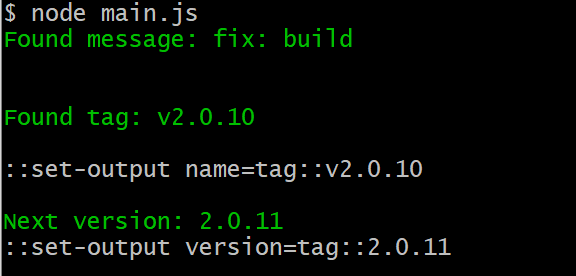

# github-next-version
Gets next version of project based on previous commit tag and commit messages.

# Get previous tag

Github Action that gets the latest tag from git



## Output

This action has two output: 
    `tag` for the latest tag this action finds.
    `version` the next version that should be used 

The next version is determined by commit messages since the last tag created.

Commit message conventions:
fix: will update the 3 (patch) number of the version
feat: will update the 2 (minor) number of the version
BREAKING will update the 1(major) number of the version

## Example

```yaml
name: Generate
jobs:
  generate:
    steps:
      - uses: actions/checkout@v1
      - name: 'Get Previous tag'
        id: semver
        uses: "cdotyone/github-next-version@master"
        env:
          GITHUB_TOKEN: "${{ secrets.GITHUB_TOKEN }}"
```

